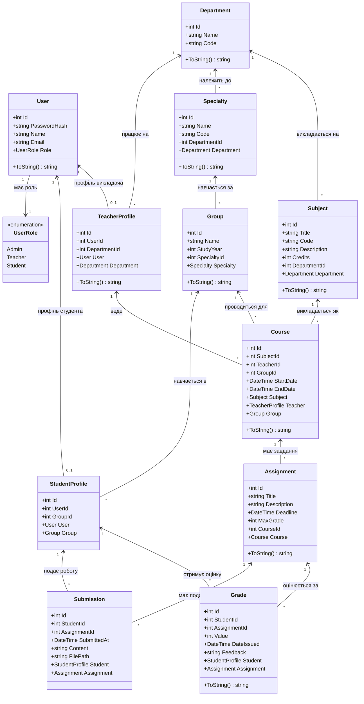
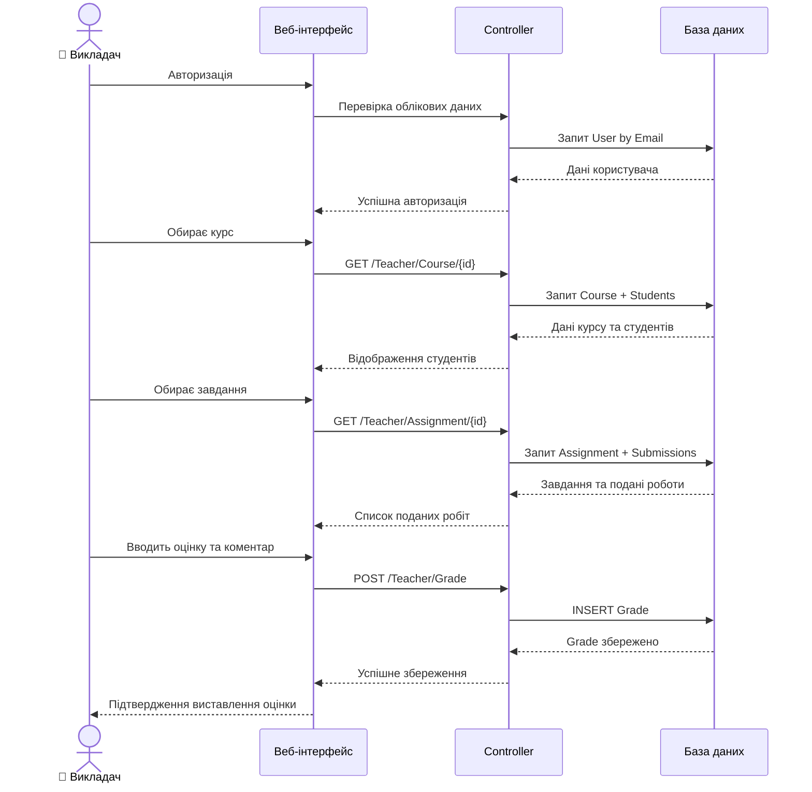
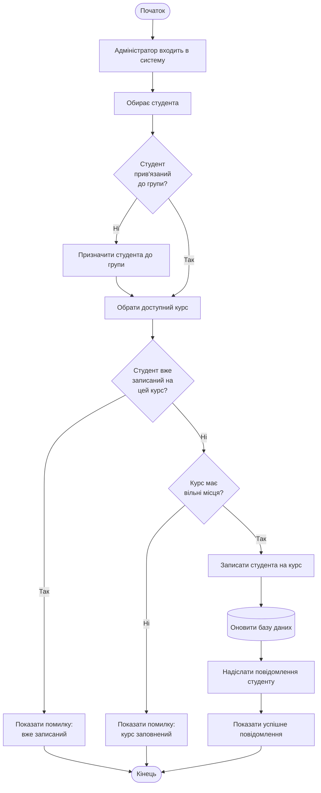
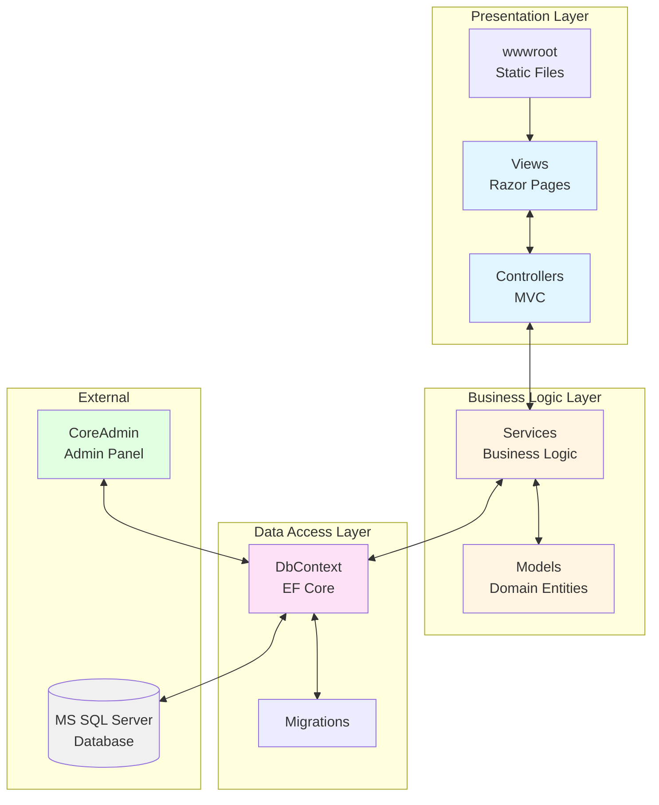

# UML-діаграми для MyRACIT

## 1. Use Case діаграма (Діаграма варіантів використання)

```mermaid
graph TB
    subgraph "Інформаційна система MyRACIT"
        %% Адміністративні функції
        UC1[Керування кафедрами]
        UC2[Керування спеціальностями]
        UC3[Керування групами]
        UC4[Керування дисциплінами]
        UC5[Створення облікових записів студентів]
        UC6[Створення облікових записів викладачів]
        UC7[Реєстрація студентів на курси]
        
        %% Функції викладача
        UC8[Перегляд списку студентів курсу]
        UC9[Створення завдань]
        UC10[Виставлення оцінок]
        UC11[Надання зворотного зв'язку]
        UC12[Перегляд поданих робіт]
        
        %% Функції студента
        UC13[Заповнення профілю]
        UC14[Перегляд своїх курсів]
        UC15[Перегляд завдань]
        UC16[Подання робіт]
        UC17[Перегляд своїх оцінок]
        
        %% Загальні функції
        UC18[Авторизація в системі]
        UC19[Перегляд розкладу]
    end
    
    Admin[👤 Адміністратор]
    Teacher[👤 Викладач]
    Student[👤 Студент]
    
    %% Адміністратор
    Admin --> UC1
    Admin --> UC2
    Admin --> UC3
    Admin --> UC4
    Admin --> UC5
    Admin --> UC6
    Admin --> UC7
    Admin --> UC18
    
    %% Викладач
    Teacher --> UC8
    Teacher --> UC9
    Teacher --> UC10
    Teacher --> UC11
    Teacher --> UC12
    Teacher --> UC18
    Teacher --> UC19
    
    %% Студент
    Student --> UC13
    Student --> UC14
    Student --> UC15
    Student --> UC16
    Student --> UC17
    Student --> UC18
    Student --> UC19
    
    style Admin fill:#ff6b6b
    style Teacher fill:#4ecdc4
    style Student fill:#95e1d3
```

## 2. Class діаграма (Діаграма класів)

## 3. ER-діаграма (Entity-Relationship)

```mermaid
erDiagram
    User ||--o| StudentProfile : "має"
    User ||--o| TeacherProfile : "має"
    User ||--|| UserRole : "належить до"
    
    Department ||--o{ TeacherProfile : "працюють"
    Department ||--o{ Specialty : "містить"
    Department ||--o{ Subject : "викладає"
    
    Specialty ||--o{ Group : "навчаються"
    
    Group ||--o{ StudentProfile : "навчаються в"
    Group ||--o{ Course : "відвідують"
    
    Subject ||--o{ Course : "є курсом"
    TeacherProfile ||--o{ Course : "веде"
    
    Course ||--o{ Assignment : "має завдання"
    
    StudentProfile ||--o{ Submission : "подає"
    Assignment ||--o{ Submission : "отримує подання"
    
    StudentProfile ||--o{ Grade : "отримує"
    Assignment ||--o{ Grade : "оцінюється"
    
    User {
        int Id PK
        string PasswordHash
        string Name
        string Email
        enum Role
    }
    
    StudentProfile {
        int Id PK
        int UserId FK
        int GroupId FK
    }
    
    TeacherProfile {
        int Id PK
        int UserId FK
        int DepartmentId FK
    }
    
    Department {
        int Id PK
        string Name
        string Code
    }
    
    Specialty {
        int Id PK
        string Name
        string Code
        int DepartmentId FK
    }
    
    Group {
        int Id PK
        string Name
        int StudyYear
        int SpecialtyId FK
    }
    
    Subject {
        int Id PK
        string Title
        string Code
        string Description
        int Credits
        int DepartmentId FK
    }
    
    Course {
        int Id PK
        int SubjectId FK
        int TeacherId FK
        int GroupId FK
        date StartDate
        date EndDate
    }
    
    Assignment {
        int Id PK
        string Title
        string Description
        datetime Deadline
        int MaxGrade
        int CourseId FK
    }
    
    Submission {
        int Id PK
        int StudentId FK
        int AssignmentId FK
        datetime SubmittedAt
        string Content
        string FilePath
    }
    
    Grade {
        int Id PK
        int StudentId FK
        int AssignmentId FK
        int Value
        datetime DateIssued
        string Feedback
    }
```

## 4. Sequence діаграма: Виставлення оцінки викладачем

## 5. Activity діаграма: Реєстрація студента на курс

## 6. Component діаграма: Архітектура системи

## Опис компонентів системи

### Presentation Layer (Рівень презентації)
- **Views**: Razor-шаблони для відображення UI
- **Controllers**: MVC-контролери для обробки запитів
- **wwwroot**: Статичні файли (CSS, JS, зображення)

### Business Logic Layer (Рівень бізнес-логіки)
- **Services**: Сервіси з бізнес-логікою
- **Models**: Доменні моделі (Entity classes)

### Data Access Layer (Рівень доступу до даних)
- **DbContext**: Entity Framework Core контекст
- **Migrations**: Міграції бази даних

### External Components (Зовнішні компоненти)
- **MS SQL Server**: Реляційна база даних
- **CoreAdmin**: Бібліотека для адміністративної панелі

## Основні сценарії використання

### Адміністратор:
1. Керування довідниками (кафедри, спеціальності, дисципліни)
2. Створення та управління групами
3. Реєстрація користувачів (студентів і викладачів)
4. Призначення студентів до груп
5. Створення курсів та призначення викладачів

### Викладач:
1. Перегляд закріплених курсів
2. Створення завдань для курсу
3. Перегляд поданих робіт студентів
4. Виставлення оцінок
5. Надання зворотного зв'язку

### Студент:
1. Перегляд своїх курсів
2. Перегляд завдань
3. Подання виконаних робіт
4. Перегляд отриманих оцінок та коментарів
5. Заповнення та редагування профілю
