# UML-діаграми для MyRACIT

## 1. Use Case діаграма (Діаграма варіантів використання)

```mermaid
graph TB
    subgraph "Інформаційна система MyRACIT"
        %% Адміністративні функції
        UC1[Керування кафедрами]
        UC2[Керування спеціальностями]
        UC3[Керування групами]
        UC4[Керування дисциплінами]
        UC5[Створення облікових записів студентів]
        UC6[Створення облікових записів викладачів]
        UC7[Реєстрація студентів на курси]
        
        %% Функції викладача
        UC8[Перегляд списку студентів курсу]
        UC9[Створення завдань]
        UC10[Виставлення оцінок]
        UC11[Надання зворотного зв'язку]
        UC12[Перегляд поданих робіт]
        
        %% Функції студента
        UC13[Заповнення профілю]
        UC14[Перегляд своїх курсів]
        UC15[Перегляд завдань]
        UC16[Подання робіт]
        UC17[Перегляд своїх оцінок]
        
        %% Загальні функції
        UC18[Авторизація в системі]
        UC19[Перегляд розкладу]
    end
    
    Admin[👤 Адміністратор]
    Teacher[👤 Викладач]
    Student[👤 Студент]
    
    %% Адміністратор
    Admin --> UC1
    Admin --> UC2
    Admin --> UC3
    Admin --> UC4
    Admin --> UC5
    Admin --> UC6
    Admin --> UC7
    Admin --> UC18
    
    %% Викладач
    Teacher --> UC8
    Teacher --> UC9
    Teacher --> UC10
    Teacher --> UC11
    Teacher --> UC12
    Teacher --> UC18
    Teacher --> UC19
    
    %% Студент
    Student --> UC13
    Student --> UC14
    Student --> UC15
    Student --> UC16
    Student --> UC17
    Student --> UC18
    Student --> UC19
    
    style Admin fill:#ff6b6b
    style Teacher fill:#4ecdc4
    style Student fill:#95e1d3
```

## 2. Class діаграма (Діаграма класів)

### 2.1. Виділення класів предметної області

Система MyRACIT містить наступні класи:
- **User** - базовий клас користувача системи
- **UserRole** - enum для ролей користувачів
- **StudentProfile** - профіль студента
- **TeacherProfile** - профіль викладача
- **Department** - кафедра закладу освіти
- **Specialty** - спеціальність
- **Group** - навчальна група
- **Subject** - навчальна дисципліна (предмет)
- **Course** - семестровий курс (зв'язок предмету, викладача та групи)
- **Assignment** - навчальне завдання
- **AssignmentFile** - файл прикріплений до завдання
- **AssignmentLink** - посилання прикріплене до завдання
- **Submission** - здана робота студента
- **Grade** - оцінка за здану роботу

### 2.2. Атрибути та методи класів

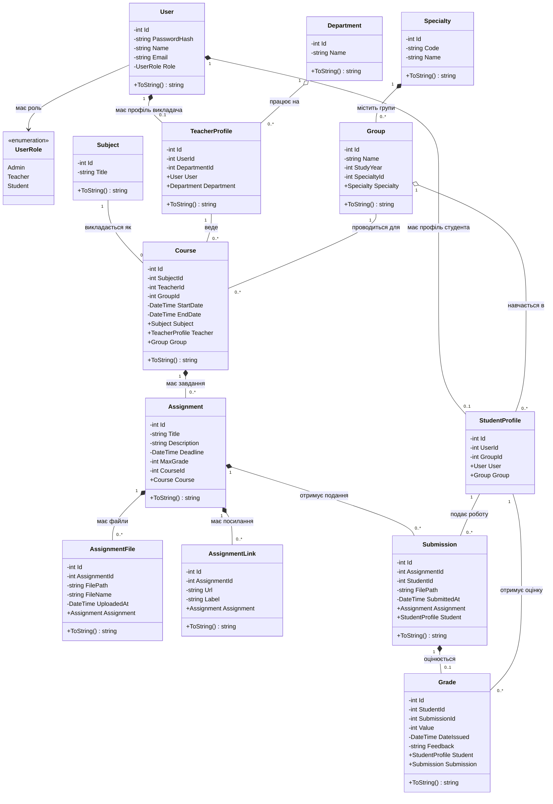

### 2.3. Типи зв'язків між класами

**Асоціація (Association)** `--`:
- User → UserRole: користувач має роль
- Subject → Course: предмет викладається як курс
- TeacherProfile → Course: викладач веде курс
- Group → Course: група відвідує курс
- StudentProfile → Submission: студент подає роботу
- StudentProfile → Grade: студент отримує оцінку

**Агрегація (Aggregation)** `o--` (ціле може існувати без частин):
- Department o-- TeacherProfile: кафедра може існувати без викладачів
- Group o-- StudentProfile: група може існувати без студентів

**Композиція (Composition)** `*--` (ціле не може існувати без частин, або частина не існує без цілого):
- User *-- StudentProfile: профіль студента не існує без користувача
- User *-- TeacherProfile: профіль викладача не існує без користувача
- Specialty *-- Group: група завжди належить спеціальності
- Course *-- Assignment: завдання не існує без курсу
- Assignment *-- AssignmentFile: файл не існує без завдання
- Assignment *-- AssignmentLink: посилання не існує без завдання
- Assignment *-- Submission: подання не існує без завдання
- Submission *-- Grade: оцінка не існує без конкретної зданої роботи

**Наслідування (Inheritance)**: 
- Не використовується в даній системі (всі класи незалежні)

### 2.4. Пояснення структури класів

#### Базові класи (Core Entities):
- **User** - центральний клас системи, що представляє користувача. Має роль (Admin/Teacher/Student) та базову інформацію (ім'я, email, пароль)
- **StudentProfile** / **TeacherProfile** - розширюють функціональність User додатковою інформацією про студента або викладача
- **UserRole** - enum для строгої типізації ролей

#### Організаційна структура (Organization):
- **Department** - кафедра закладу освіти
- **Specialty** - спеціальність (наприклад, "Інженерія програмного забезпечення")
- **Group** - академічна група студентів (наприклад, "ІПЗ-21")
- **Subject** - навчальна дисципліна (наприклад, "Програмування на C#")

#### Навчальний процес (Academic Process):
- **Course** - семестровий курс, що зв'язує Subject, Teacher та Group
- **Assignment** - завдання для курсу (домашня робота або лабораторна)
- **AssignmentFile** - файли прикріплені до завдання (презентації, методички)
- **AssignmentLink** - посилання на ресурси для завдання
- **Submission** - здана робота студента
- **Grade** - оцінка за конкретну здану роботу

#### Ключові рішення архітектури:
1. **Grade прив'язаний до Submission**, а не Assignment - це дозволяє оцінювати конкретну здачу, підтримувати перездачі
2. **AssignmentFile та AssignmentLink** - окремі таблиці для матеріалів завдання (масштабованість)
3. **Composition для Grade-Submission** - оцінка не може існувати без конкретної зданої роботи
4. **Aggregation для Group-Student** - група може існувати без студентів (на початку семестру)

## 3. ER-діаграма (Entity-Relationship)

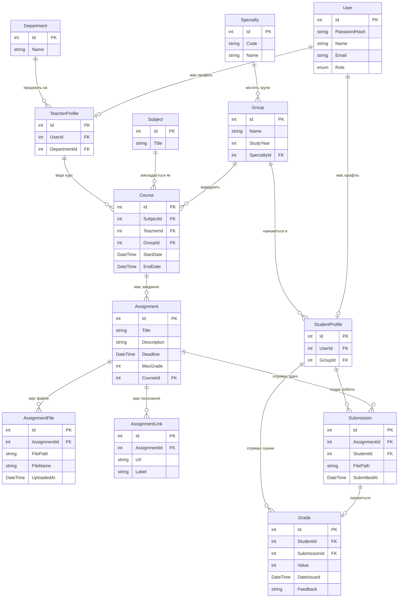

## 4. Sequence діаграма: Виставлення оцінки викладачем

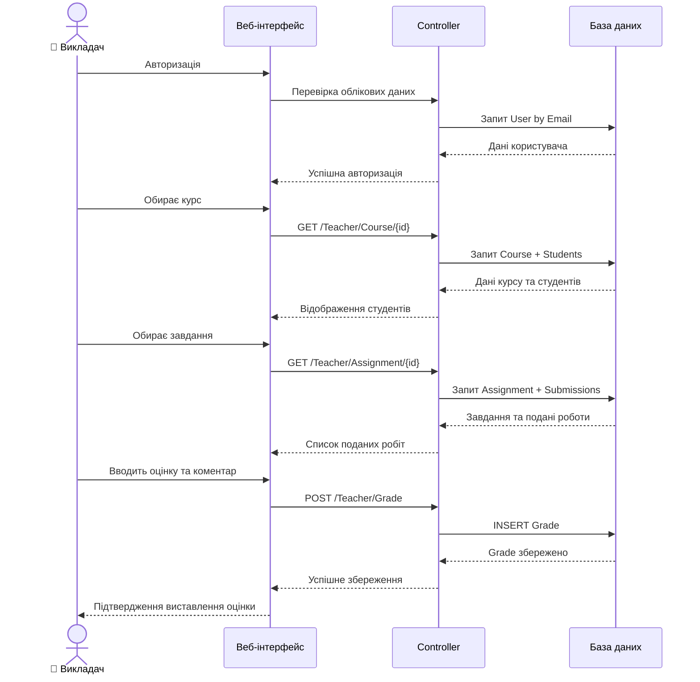

## 5. Activity діаграма: Реєстрація студента на курс

## 6. Component діаграма: Архітектура системи

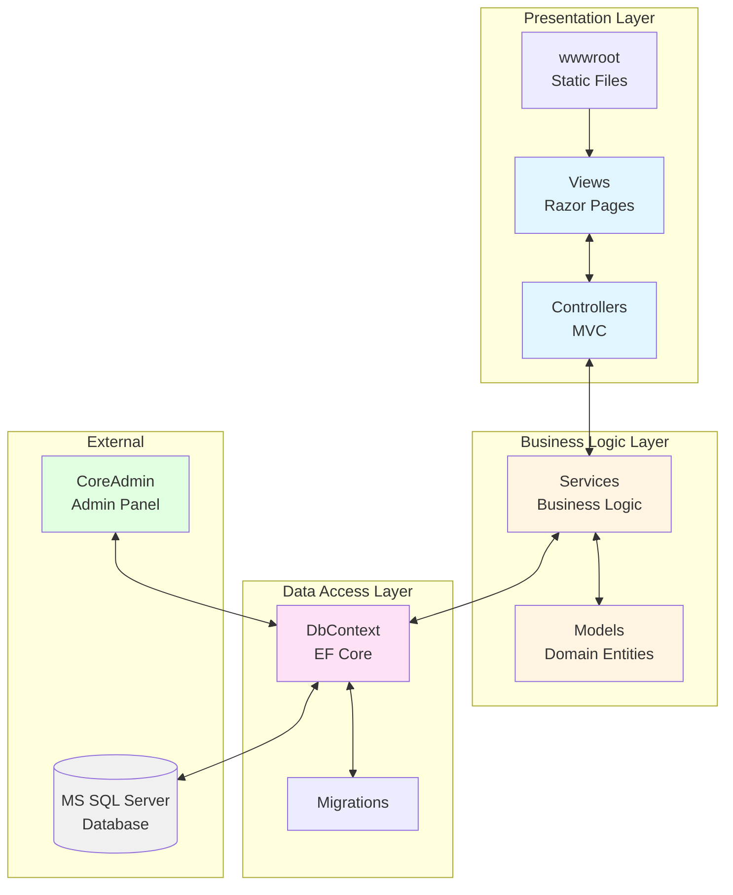

## Опис компонентів системи

### Presentation Layer (Рівень презентації)
- **Views**: Razor-шаблони для відображення UI
- **Controllers**: MVC-контролери для обробки запитів
- **wwwroot**: Статичні файли (CSS, JS, зображення)

### Business Logic Layer (Рівень бізнес-логіки)
- **Services**: Сервіси з бізнес-логікою
- **Models**: Доменні моделі (Entity classes)

### Data Access Layer (Рівень доступу до даних)
- **DbContext**: Entity Framework Core контекст
- **Migrations**: Міграції бази даних

### External Components (Зовнішні компоненти)
- **MS SQL Server**: Реляційна база даних
- **CoreAdmin**: Бібліотека для адміністративної панелі

## Основні сценарії використання

### Адміністратор:
1. Керування довідниками (кафедри, спеціальності, дисципліни)
2. Створення та управління групами
3. Реєстрація користувачів (студентів і викладачів)
4. Призначення студентів до груп
5. Створення курсів та призначення викладачів

### Викладач:
1. Перегляд закріплених курсів
2. Створення завдань для курсу
3. Перегляд поданих робіт студентів
4. Виставлення оцінок
5. Надання зворотного зв'язку

### Студент:
1. Перегляд своїх курсів
2. Перегляд завдань
3. Подання виконаних робіт
4. Перегляд отриманих оцінок та коментарів
5. Заповнення та редагування профілю

## 7. Service Layer діаграма: Сервіси та їх інтерфейси

```mermaid
classDiagram
    %% ============ INTERFACES ============
    class IUserService {
        <<interface>>
        +CreateStudentAsync(name, email, password, groupId) Task~StudentProfile~
        +CreateTeacherAsync(name, email, password, departmentId) Task~TeacherProfile~
        +CreateAdminAsync(name, email, password) Task~User~
        +AuthenticateAsync(email, password) Task~User~
        +ChangePasswordAsync(userId, oldPassword, newPassword) Task
        +EmailExistsAsync(email) Task~bool~
        +GetStudentProfileAsync(userId) Task~StudentProfile~
        +GetTeacherProfileAsync(userId) Task~TeacherProfile~
        +UpdateUserProfileAsync(userId, name, email) Task
        +DeleteUserAsync(userId) Task
    }
    
    class IFileStorageService {
        <<interface>>
        +SaveFileAsync(file, folder) Task~string~
        +GetFileAsync(filePath) Task~byte[]~
        +DeleteFileAsync(filePath) Task
        +FileExists(filePath) bool
        +GetFileSize(filePath) long
        +GetContentType(fileName) string
    }
    
    class IEmailService {
        <<interface>>
        +SendEmailAsync(to, subject, body) Task
        +SendCredentialsAsync(to, name, email, password, role) Task
        +SendNewCourseNotificationAsync(to, studentName, courseName, teacherName) Task
        +SendNewAssignmentNotificationAsync(to, studentName, assignmentTitle, dueDate) Task
        +SendGradeNotificationAsync(to, studentName, assignmentTitle, points, maxPoints, feedback) Task
    }
    
    %% ============ IMPLEMENTATIONS ============
    class UserService {
        -MyRacitDbContext _context
        +CreateStudentAsync(name, email, password, groupId) Task~StudentProfile~
        +CreateTeacherAsync(name, email, password, departmentId) Task~TeacherProfile~
        +CreateAdminAsync(name, email, password) Task~User~
        +AuthenticateAsync(email, password) Task~User~
        +ChangePasswordAsync(userId, oldPassword, newPassword) Task
        +EmailExistsAsync(email) Task~bool~
        +GetStudentProfileAsync(userId) Task~StudentProfile~
        +GetTeacherProfileAsync(userId) Task~TeacherProfile~
        +UpdateUserProfileAsync(userId, name, email) Task
        +DeleteUserAsync(userId) Task
        -HashPassword(password) string
        -VerifyPassword(password, hash) bool
    }
    
    class FileStorageService {
        -IWebHostEnvironment _environment
        -string _uploadsFolderPath
        +SaveFileAsync(file, folder) Task~string~
        +GetFileAsync(filePath) Task~byte[]~
        +DeleteFileAsync(filePath) Task
        +FileExists(filePath) bool
        +GetFileSize(filePath) long
        +GetContentType(fileName) string
        -EnsureDirectoryExists(path) void
        -GenerateUniqueFileName(originalFileName) string
    }
    
    class EmailService {
        -IConfiguration _configuration
        -ILogger~EmailService~ _logger
        +SendEmailAsync(to, subject, body) Task
        +SendCredentialsAsync(to, name, email, password, role) Task
        +SendNewCourseNotificationAsync(to, studentName, courseName, teacherName) Task
        +SendNewAssignmentNotificationAsync(to, studentName, assignmentTitle, dueDate) Task
        +SendGradeNotificationAsync(to, studentName, assignmentTitle, points, maxPoints, feedback) Task
        -CreateSmtpClient() SmtpClient
        -BuildHtmlEmail(template, data) string
    }
    
    %% ============ CONTROLLERS ============
    class AdminController {
        -IUserService _userService
        -IEmailService _emailService
        -MyRacitDbContext _context
        +CreateStudent() IActionResult
        +CreateTeacher() IActionResult
        +DeleteUser(userId) IActionResult
    }
    
    class AuthController {
        -IUserService _userService
        +Login(email, password) IActionResult
        +Logout() IActionResult
        +ChangePassword() IActionResult
    }
    
    class TeacherController {
        -IFileStorageService _fileStorageService
        -IEmailService _emailService
        -MyRacitDbContext _context
        +UploadAssignmentFile() IActionResult
        +DownloadFile() IActionResult
        +GradeSubmission() IActionResult
    }
    
    class StudentController {
        -IFileStorageService _fileStorageService
        -MyRacitDbContext _context
        +SubmitAssignment() IActionResult
        +DownloadSubmission() IActionResult
        +DeleteSubmission() IActionResult
    }
    
    %% ============ DATA CONTEXT ============
    class MyRacitDbContext {
        +DbSet~User~ Users
        +DbSet~StudentProfile~ StudentProfiles
        +DbSet~TeacherProfile~ TeacherProfiles
        +DbSet~Assignment~ Assignments
        +DbSet~Submission~ Submissions
        +DbSet~Grade~ Grades
        +SaveChangesAsync() Task
    }
    
    %% ============ DTOs ============
    class CreateStudentDto {
        +string Name
        +string Email
        +string Password
        +int GroupId
    }
    
    class CreateTeacherDto {
        +string Name
        +string Email
        +string Password
        +int DepartmentId
    }
    
    class LoginDto {
        +string Email
        +string Password
        +bool RememberMe
    }
    
    %% ============ RELATIONSHIPS ============
    %% Implementation relationships
    IUserService <|.. UserService : implements
    IFileStorageService <|.. FileStorageService : implements
    IEmailService <|.. EmailService : implements
    
    %% Service dependencies
    UserService --> MyRacitDbContext : uses
    FileStorageService --> IWebHostEnvironment : uses
    EmailService --> IConfiguration : uses
    EmailService --> ILogger : uses
    
    %% Controller dependencies
    AdminController --> IUserService : uses
    AdminController --> IEmailService : uses
    AdminController --> MyRacitDbContext : uses
    
    AuthController --> IUserService : uses
    
    TeacherController --> IFileStorageService : uses
    TeacherController --> IEmailService : uses
    TeacherController --> MyRacitDbContext : uses
    
    StudentController --> IFileStorageService : uses
    StudentController --> MyRacitDbContext : uses
    
    %% DTOs usage
    AdminController --> CreateStudentDto : uses
    AdminController --> CreateTeacherDto : uses
    AuthController --> LoginDto : uses
    
    %% Service interactions
    AdminController ..> UserService : CreateStudentAsync()
    AdminController ..> EmailService : SendCredentialsAsync()
    TeacherController ..> FileStorageService : SaveFileAsync()
    StudentController ..> FileStorageService : SaveFileAsync()
```

## 8. Sequence діаграма: Створення студента з надсиланням credentials

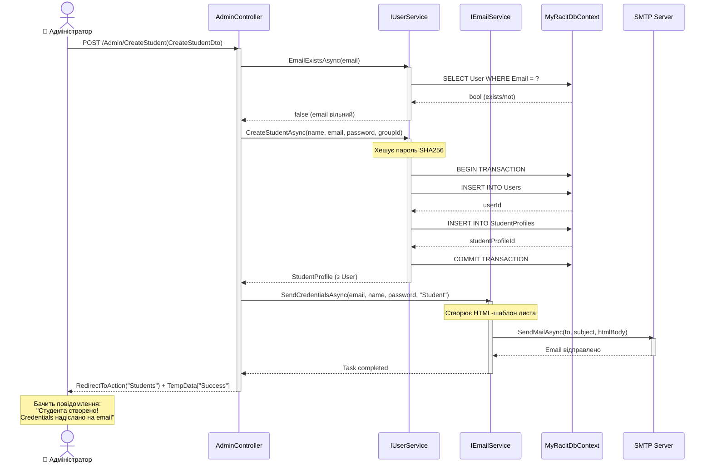

## 9. Sequence діаграма: Подання роботи з файлом

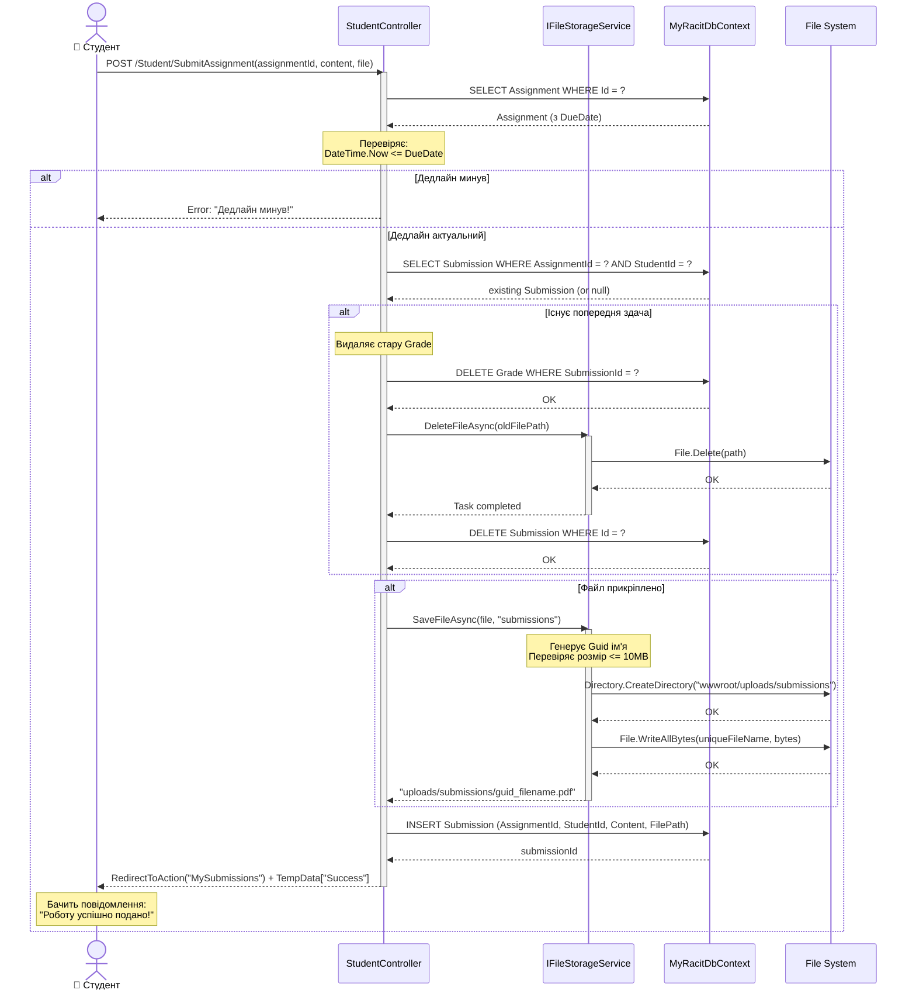

## 10. Sequence діаграма: Оцінювання роботи з надсиланням сповіщення

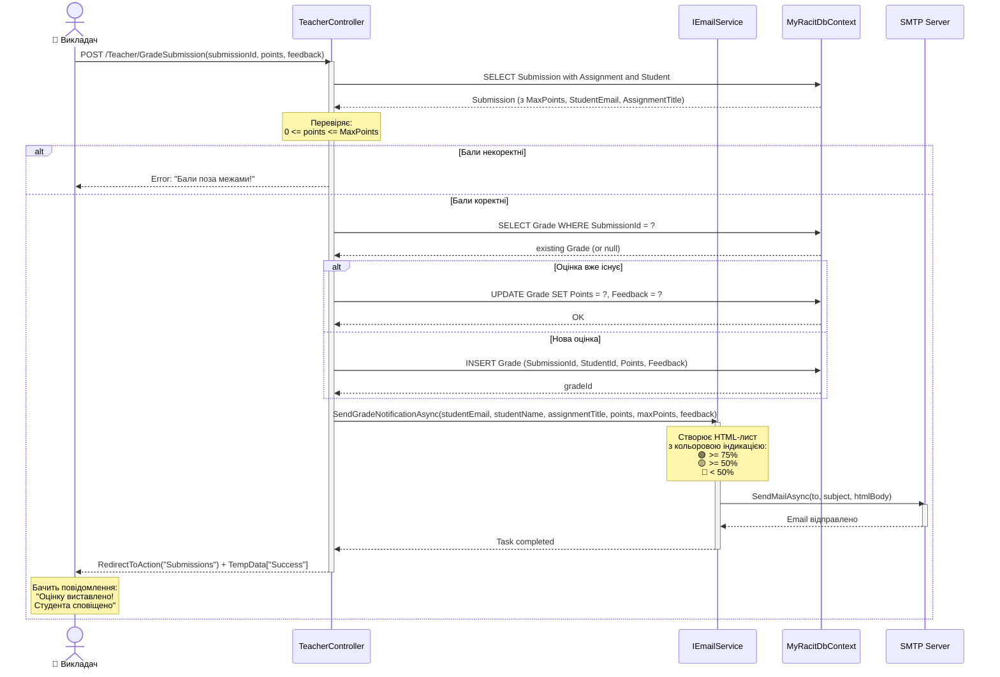

## 11. Service Layer: Патерни проектування

### Factory Method Pattern (UserService)

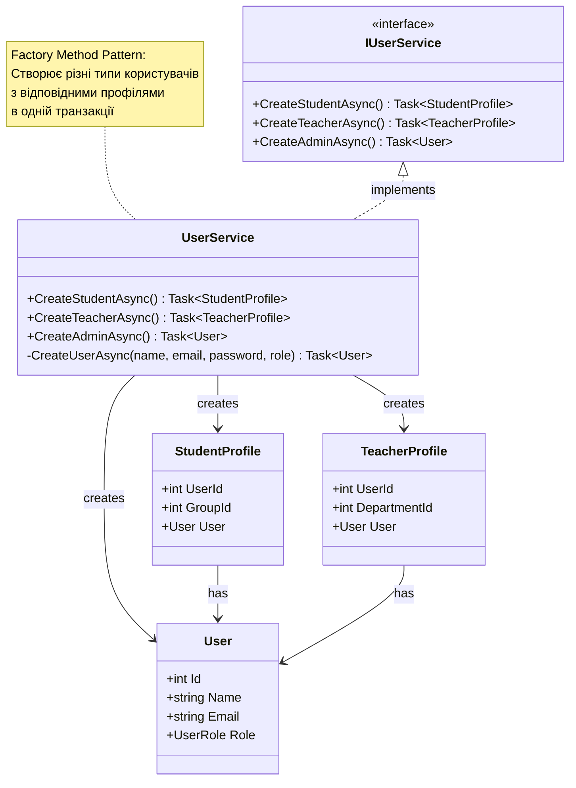

**Переваги Factory Method Pattern:**
- ✅ Інкапсуляція логіки створення користувачів
- ✅ Автоматичне хешування паролів
- ✅ Транзакційне створення User + Profile
- ✅ Централізована валідація email
- ✅ Легке розширення новими типами користувачів

### Strategy Pattern (FileStorageService)

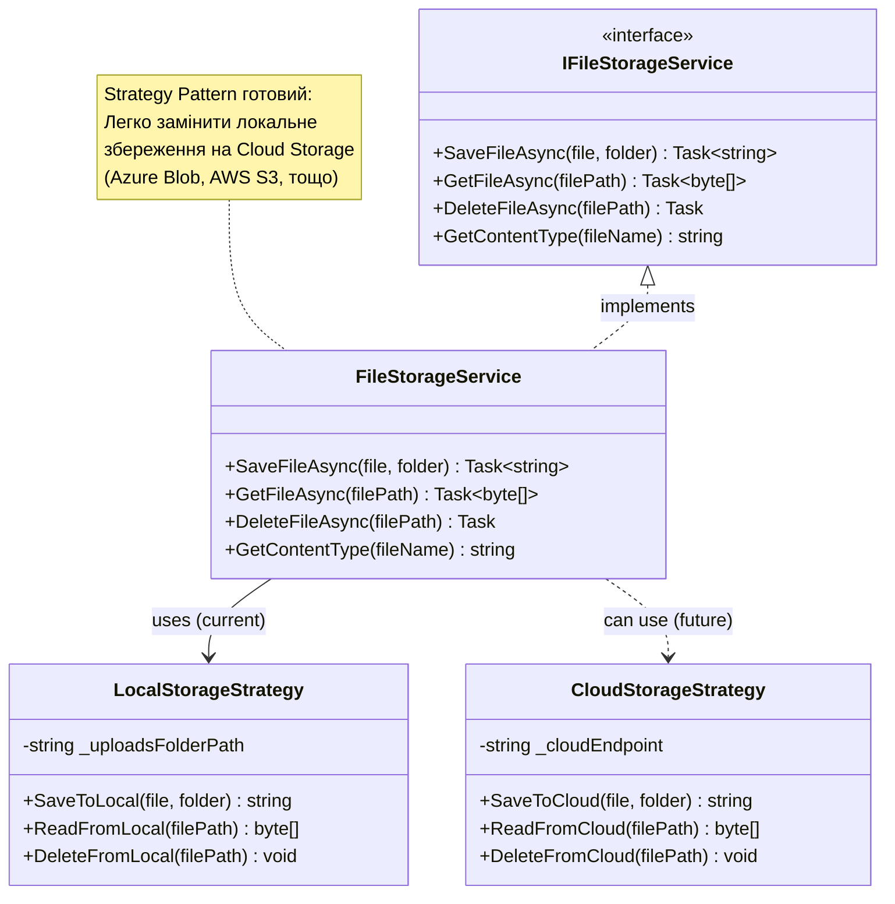

**Переваги Strategy Pattern:**
- ✅ Легка заміна способу збереження файлів
- ✅ Тестування з in-memory storage
- ✅ Підтримка різних сховищ для різних файлів
- ✅ Масштабованість (локально → хмара)

### Template Method Pattern (EmailService)

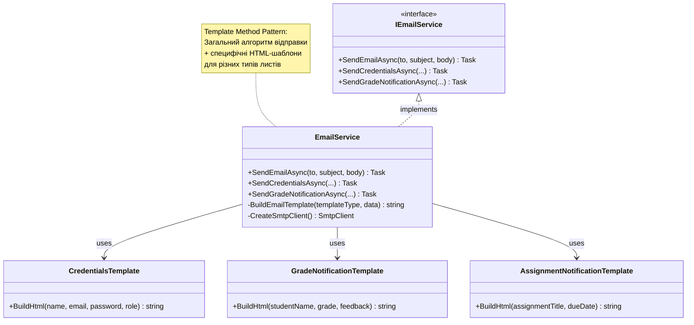

**Переваги Template Method Pattern:**
- ✅ Єдиний метод відправки (DRY)
- ✅ Легке додавання нових типів листів
- ✅ Централізоване логування помилок
- ✅ Fallback якщо SMTP не налаштований

## 12. Архітектура застосунку: повна картина

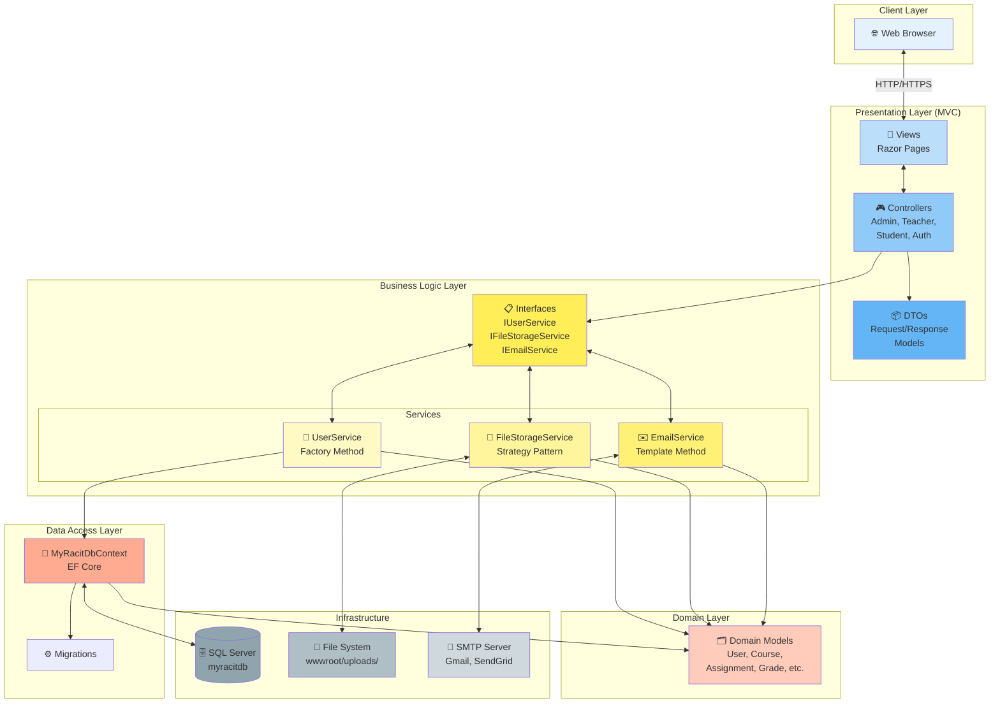

### Опис архітектури:

**Client Layer:**
- Web Browser - користувацький інтерфейс (Chrome, Firefox, Edge)

**Presentation Layer (MVC):**
- **Views** - Razor Pages для відображення UI
- **Controllers** - обробка HTTP-запитів, валідація, маршрутизація
- **DTOs** - Data Transfer Objects для передачі даних між шарами

**Business Logic Layer:**
- **IUserService** / **UserService** - управління користувачами (Factory Method)
- **IFileStorageService** / **FileStorageService** - робота з файлами (Strategy)
- **IEmailService** / **EmailService** - відправка email (Template Method)

**Domain Layer:**
- **Models** - доменні сутності (User, Course, Assignment, Grade, etc.)

**Data Access Layer:**
- **MyRacitDbContext** - Entity Framework Core контекст
- **Migrations** - міграції бази даних

**Infrastructure:**
- **SQL Server** - реляційна база даних
- **File System** - локальне збереження файлів
- **SMTP Server** - сервер для відправки email

### Переваги архітектури:

✅ **Separation of Concerns** - кожен шар має свою відповідальність
✅ **Dependency Injection** - всі сервіси через інтерфейси
✅ **Testability** - легко писати Unit-тести для сервісів
✅ **Maintainability** - зміни в одному шарі не впливають на інші
✅ **Scalability** - можна легко замінити File System на Cloud Storage
✅ **Security** - Authentication/Authorization на рівні Controllers
